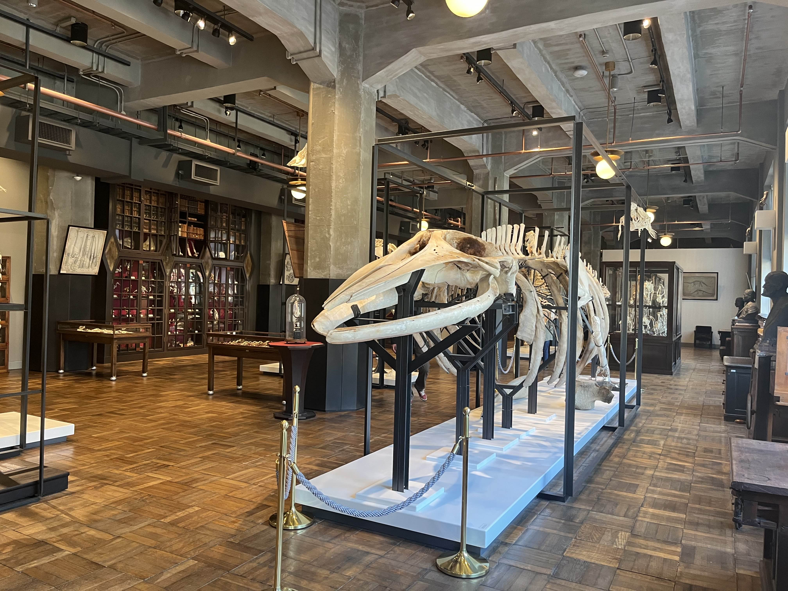

# ⁑ La Baleine

!!! abstract "Contexte"
    Challenge proposé par le prof – Janvier 2026

**Toto le chat** adore les musées d'Histoire Naturelle. Lors d'une de ces visites, il croise **ce superbe squelette de baleine** :

!!! question "Question"
    **Quel est l'identifiant utilisée par le musée pour cette pièce de collection ?**

    Format de réponse : `MNHN_AA9892110`.
    
    === "Anonyme"
        

            <label for="flag_anon">Réponse</label>
            

                

                <input type="text" id="flag_anon" class="info-input-input" spellcheck="false" placeholder="réponse">
            

            <input id="submit_anon" class="input-submit" type="button" value="Vérifier" onclick="check_flag_anon('la_baleine');">
        

    === "Via profil"
        

            <label for="username">Identifiants</label>
            

                

                <input type="text" id="username" class="info-input-input" spellcheck="false" placeholder="identifiant">
                :
                <input type="password" id="password" class="info-input-input" spellcheck="false" placeholder="mot de passe">
            

            <label for="flag">Réponse</label>
            

                

                <input type="text" id="flag" class="info-input-input" spellcheck="false" placeholder="réponse">
            

            <input id="submit" class="input-submit" type="button" value="Vérifier" onclick="check_flag('la_baleine');">
        

