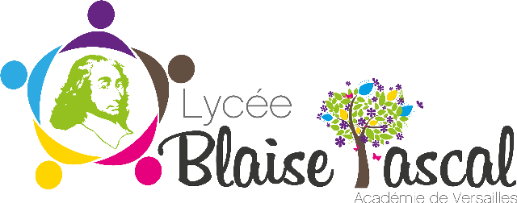

# Numériques et Sciences Informatiques – Lycée Blaise Pascal

Bienvenue sur le site Web de la spécialité **Numérique et Sciences Informatiques** du lycée Blaise Pascal.

**Ce site Web et toutes les ressources**, sauf indication contraire, sont réalisées par **Anaël BARODINE**, professeur de NSI, et **[le code source est ouvert](https://github.com/NastiouchaNakamura/web-site-nsi)**. Le site Web et l'ensemble des ressources, sauf indication contraire, **sont placés sous la licence <a href="https://creativecommons.org/licenses/by-nc-sa/4.0/deed.fr" target="_blank" style="display:inline-block;">CC BY-NC-SA 4.0</a>**.
